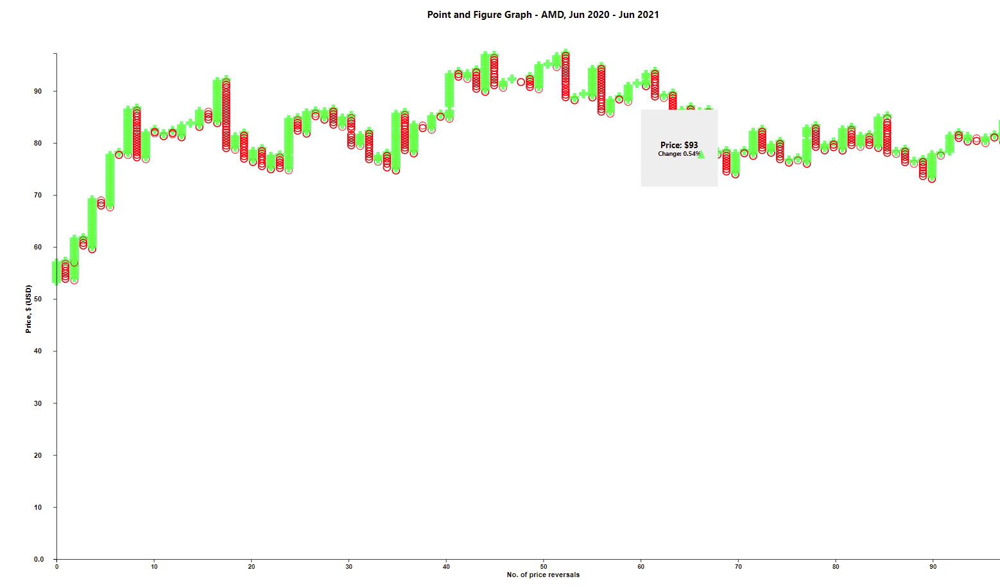

# The Point and Figure Graph

A point and figure graph is a graph that can be used to gauge entry and exits for trading long term assets. It was invented by Charles Dow in 1890, and used heavily by [Richard Wyckoff](https://school.stockcharts.com/doku.php?id=market_analysis:the_wyckoff_method). I came to learn of these while reading on investing techniques in my spare time, and decided to make these charts. According to [Investopedia](https://www.investopedia.com/articles/technical/03/081303.asp), a point and figure graph is unique in that _'they do not account for the discrete passage of time as most other types of chart do along their x-axes'_.

It is implemented with D3 to create the visualisations using data from [yahoo!finance](https://finance.yahoo.com/). The project was bootstrapped with [Create React App](https://github.com/facebook/create-react-app).

## The Point and Figure of AMD Jun 2020 - Jun 2021

This is an example of the v0.1 implementation of my point and figure graph using AMD daily stock price data from Yahoo Finance.

## The Code

### D3 Dependencies

The only hard dependency for the project is [D3](https://github.com/d3/d3). I chose to use a yarn module since I used a bootstrapped React App, but replacing imports at the top of `graph.js` and `figureAndPoint.js` with other import techniques should work.
This may be updated to give better instructions for your own use. Check back later.

### Implementation

The files are structured in a React app, with the D3 implementation of the point and figure under `src\d3\figureAndPoint.js`. It is implemented as a mixin for my own base JS class I call a 'graph' (`src\d3\graph.js`). Mixins allow me to create various kinds of graphs with a separation of use and reuse, and allows me to create factory methods for particular kinds of graphs. The graph and the mixins are the 'use' features. You could think of the sections in useEffect() within `src\App.js` that give the graph its properties (the `Object.assign(graph,<mixin>)`) as a factory for a behaviour (or 'reuse') definition of the graph. Then, other properties we assign to the graph with behaviour defined, such as `graph.setYAxis(graph.createYAxis(100, "Price, $ (USD)"));`, are also reuse features.